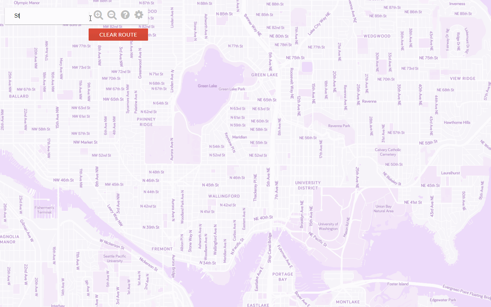

# HuskyMaps
HuskyMaps is an interactive map of the Greater Seattle Area that allows the user
  to find the shortest route from one location to another. The user can specify
  start and end location by double-clicking on the map. It also contains a search
  bar equipped with autocomplete features. It case sensitive, so queries must
  begin with a capital letter.
  
HuskyMaps is based on a graph implementation and the graph contains enough data to
  span roughly Seattle and halfway across the 520 bridge. Each node of the graph
  contains a longitude and latitude, and represents a real, physical location.
  Some have names (e.g. "Safeway") and others are just spots on the road. 
  HuskyMaps will automatically find a valid node in the graph nearest to where
  the user double-clicked.

The shortest route is computed via the A* search algorithm. Given a cheap heuristic
  function, the A* algorithm finds the shortest path faster than Dijkstra's
  algorithm. 

# Motivation
This was a school project intended to expose students to coding projects that nmore accurately reflected those of the real world. Rather than building something from scratch, this project starts with a large code base that was already written by someone else. As a result, one needs to spend time getting to know the provided code before working on the required parts of the project.

While there already exist a multitude of pathfinding programs (Google Maps, Apple Maps, etc.), HuskyMaps serves as practice for me to simulate working on an enterprise-level application, such as Google Maps. 

# How to use
HuskyMaps can be opened by running the main method of MapServer.java under huskymaps/server/MapServer.java. Demo: https://huskymaps-samw1.herokuapp.com/

The other folders included in this repository are what is required for HuskyMaps to run.
- HuskyMaps/astar: includes files about the A* search algorithm
- HuskyMaps/autocomplete: the autocomplete feature of the search bar
- HuskyMaps/kdtree: required for finding the nearest node in the graph to where the user clicked on the map. This is implemented using k-d ("k-dimensional") trees. In this case, k = 2 with the X-coordinate as one dimension and the Y-coordinate as the other.
